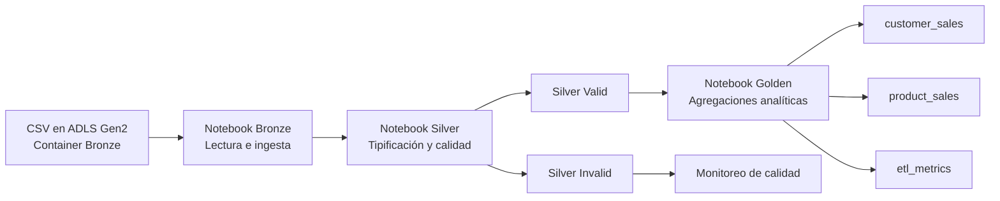
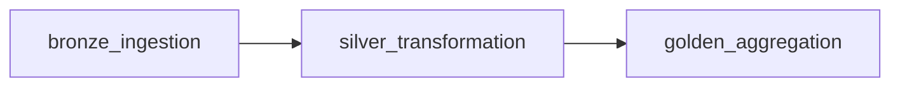

# 📊 ETL Medallion en Azure Databricks


## 🧠 Descripción del proyecto

Este proyecto implementa un pipeline de datos **end-to-end** en **Azure Databricks** siguiendo la arquitectura **Medallion** para procesar datos desde archivos CSV en la capa **Bronze**, aplicar limpieza y validación en **Silver**, y generar datasets analíticos en **Golden**.

El flujo fue diseñado con enfoque de ingeniería de datos moderna, incorporando:

- separación por capas
- reglas de calidad de datos
- persistencia en **Delta Lake**
- parametrización mediante widgets
- orquestación con **Databricks Jobs** multitarea

---

## ✨ Características principales

- Ingesta de archivos CSV desde **Azure Data Lake Storage Gen2**
- Arquitectura **Bronze → Silver → Golden**
- Validación de calidad de datos
- Separación entre registros **válidos** e **inválidos**
- Persistencia en **Delta**
- Job multitask con subtareas por capa
- Estructura reutilizable y lista para evolucionar a cargas incrementales

---

## 🏗️ Arquitectura funcional



---

## 🧱 Arquitectura Medallion

### 🔹 Bronze
Contiene los datos crudos en formato CSV.

**Archivos de entrada**
- `bronze_customers.csv`
- `bronze_orders.csv`

**Columnas técnicas**
- `ingestion_timestamp`
- `source_file`

---

### 🔹 Silver
Aplica reglas de transformación y calidad.

**Procesos**
- limpieza y normalización
- tipificación
- validaciones
- separación valid/invalid

**Salidas**
- `customers_valid`
- `customers_invalid`
- `orders_valid`
- `orders_invalid`

---

### 🔹 Golden
Genera datasets analíticos listos para consumo.

**Salidas**
- `customer_sales`
- `product_sales`
- `etl_metrics`

---

## 🗂️ Estructura del proyecto

```text
repo/
├── README.md
├── etl_bronze.py
├── etl_silver.py
├── etl_golden.py
├── databricks_job_multitask.json
└── databricks_bundle_multitask.yml
```

---

## ⚙️ Orquestación del pipeline



---
## ⚙️ Workflow en Databricks


## 🧪 Reglas de calidad de datos

### Customers
- email válido
- status válido
- campos obligatorios

### Orders
- valores positivos
- customer_id válido
- catálogos controlados

---

## 🛠️ Tecnologías utilizadas

- Azure Databricks
- PySpark
- Delta Lake
- ADLS Gen2

---

## 🔧 Parámetros

- bronze_path
- silver_path
- gold_path

---

## 🚀 Ejecución

1. Cargar archivos en Bronze
2. Ejecutar notebooks o job multitask
3. Validar resultados en Golden

---

## ✅ Buenas prácticas

- Arquitectura Medallion
- Data Quality
- Delta Lake
- Orquestación
- Parametrización

---

## 📈 Posibles mejoras

- Incremental (MERGE)
- Particionado
- Unity Catalog
- Monitoreo

---

## 💼 Valor del proyecto

Pipeline productivo alineado a estándares modernos de ingeniería de datos.

---

## 👤 Autor

Miguel Hernandez Guerrero 

[GitHub](https://github.com/miguelhg37) [LinkedIn](https://www.linkedin.com/in/miguelhg1/)

Data Engineering | Databricks | Microsof Azure | Lakehouse